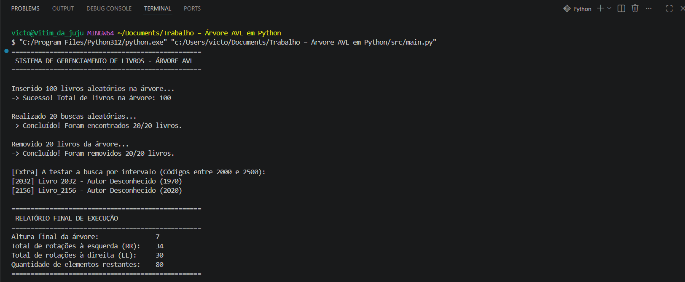

# Sistema de Gerenciamento de Livros - Árvore AVL📚

Este repositório contém a implementação completa de uma **Árvore AVL** desenvolvida inteiramente em Python.

O sistema garante um tempo de busca de `O(log N)` ao manter a árvore estritamente balanceada de forma dinâmica após cada operação de inserção ou remoção.

## 🚀 Funcionalidades

O sistema gerencia objetos do tipo `Livro` (Código, Título, Autor e Ano), utilizando o código numérico como chave de ordenação. As principais operações implementadas incluem:

- **Inserção Balanceada:** Cálculo dinâmico do Fator de Balanceamento e execução automática de rotações Simples (LL, RR) e Duplas (LR, RL).
- **Remoção Completa:** Tratamento algorítmico para remoção de nós folha, nós com 1 filho e nós com 2 filhos (com substituição pelo menor nó da subárvore direita).
- **Busca Otimizada:** Busca exata por código do livro.
- **Busca por Intervalo:** Algoritmo que "poda" os ramos da árvore durante a navegação para não visitar caminhos fora do escopo desejado (ex: buscar livros entre os códigos 2000 e 2500).
- **Percurso In-Order:** Exibição do acervo ordenado de forma crescente.
- **Métricas de Estrutura:** Leitura da altura da árvore, contagem de elementos e rastreamento do total de rotações à direita e à esquerda realizadas durante a execução.

## 📂 Estrutura do Repositório

O projeto foi modularizado visando a clareza e as boas práticas de engenharia de software:

- `/src`: Contém todo o código-fonte.
  - `avl.py`: Classe principal com a lógica de balanceamento e navegação.
  - `livro.py` e `no.py`: Estruturas fundamentais de dados.
  - `main.py`: Script principal de carga de estresse (insere 100 livros aleatórios, busca 20 e remove 20).
  - `teste_*.py`: Bateria de testes unitários isolados para validar comportamentos específicos (buscas, inserções, métricas e remoções).
- `/docs`: Contém o Relatório de Execução em PDF com a discussão teórica sobre a eficiência da estrutura em comparação com uma Árvore Binária de Busca comum, além de capturas de tela validando o comportamento do algoritmo.

## ⚙️ Como Executar

Certifique-se de ter o Python instalado em sua máquina (versão 3.x). Clone o repositório e execute os scripts da pasta `src`:

```bash
# Clone o repositório
git clone [https://github.com/Usuario/Trabalho-AVL-em-python.git](https://github.com/Usuario/Trabalho-AVL-em-python.git)

# Navegue até a pasta do código-fonte
cd Trabalho-AVL-em-python/src

# Execute o programa principal
python main.py
```

## 📊 Demonstração (Testes Gerais)

Abaixo está o registro da execução do programa principal (`main.py`). O teste demonstra a inserção de 100 livros aleatórios, validação de buscas, remoções e exibe o relatório final provando a estabilidade da árvore AVL (altura otimizada e total de rotações realizadas):



> **Nota:** Para ver os testes unitários detalhados de Rotações (LL, RR, LR, RL) e Remoções de nós específicos, consulte as imagens na pasta `/docs`.
